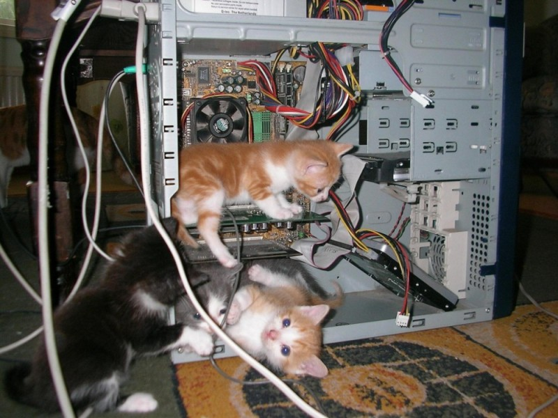

# Labs_PSTU_SVA

я, Шилоносов Вадим Алексеевич, группа ИВТ-26-1б. Я учился в 145 школе города Перми, поступил в ПНИПУ потому что люблю точные науки. Программирование это моё хобби, я занимался этим из-за собственного интереса. 
Таблица с дедлайнами:

| Название | срок | статус |
| :---: | :---: | :---: |
| задания по машине Тъюринга | до 23.09.26 | сделано |
| отчёт по блок-схемам | до 22.09.26 | сдано |
| отчёт по шаблону для УИР | до 25.09.26 | в работе |
| презентация по ОРГ | до 23.09.26 | сделано |

